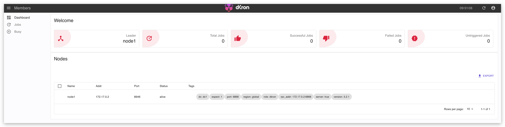
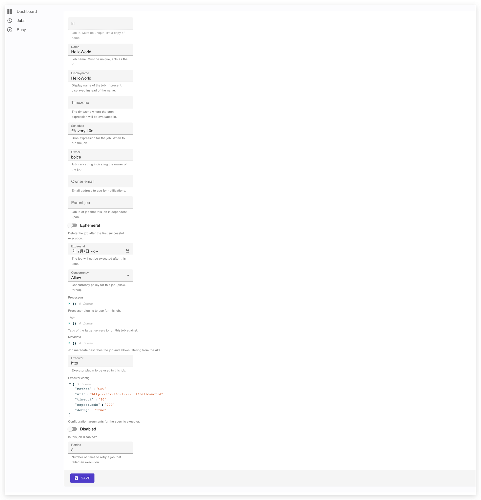
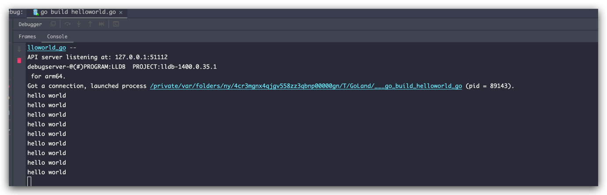
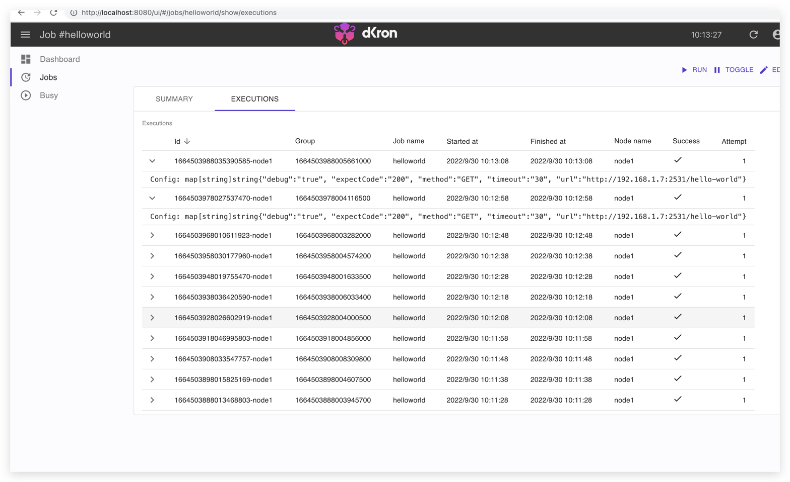

# Dkron guide

## Install Dkron

1. Run Dkron container from image

```bash
docker run -d -p 8080:8080 --name dkron dkron/dkron agent --server --bootstrap-expect=1 --node-name=node1
```

2. Open the browser url http://localhost:8080 to enter the scheduler management background
   

## Write the go version of Dkron-executor


1. Write an http server to listen on port 2531 and expose a hello world endpoint

```go
http.HandleFunc("/hello-world", func (writer http.ResponseWriter, request *http.Request) {
println("hello world")
})
err := http.ListenAndServe(":2531", nil)
if err != nil {
panic(err)
}
```


## Add tasks to the dkron management system

1. Click the "Add Job" button to add a job
```json
{
   "id": "helloworld",
   "name": "helloworld",
   "displayname": "HelloWorld",
   "timezone": "Europe/Berlin",
   "schedule": "@every 10s",
   "owner": "boice",
   "owner_email": "datachaihaobo@gmail.com",
   "executor": "http",
   "executor_config": {
      "debug": "true",
      "expectCode": "200",
      "method": "GET",
      "timeout": "30",
      "url": "http://192.168.1.7:2531/hello-world"
   }
}
```



2. Save http job
3. Run go executor
```bash
go run helloworld.go
```
4. Now we see the program console output hello-world

executions

