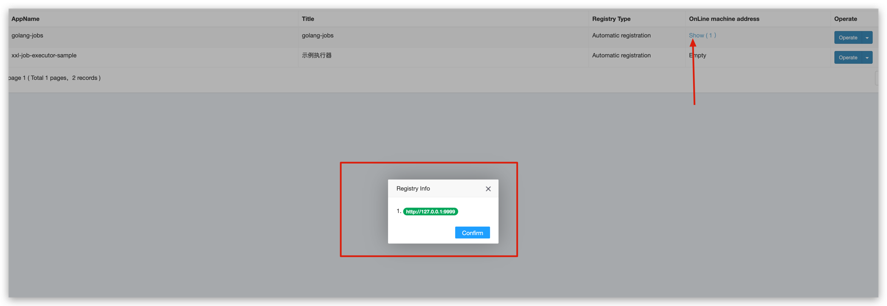

# xxl-job guide

## Install xxl-job-admin

1. Initialize the database

- ``create database xxl_job``
- ``Execute the db/xxl.sql initialization database script``

3. Pull xxl-job-admin docker image

```bash
docker pull xuxueli/xxl-job-admin:2.3.1
```

2. Run xxl-job-admin container from image

```bash
docker run -e PARAMS="\
--spring.datasource.url=jdbc:mysql://{{MYSQL_ADDR:192.168.1.125:3306}}/xxl_job?useUnicode=true&characterEncoding=UTF-8 \
--spring.datasource.username={{MySQL_USER:root}} \
--spring.datasource.password={{MYSQL_PASSWORD:123456}}  \
--xxl.job.i18n=en \
--xxl.job.accessToken= testToken\
" -p 8080:8080 -v /tmp:/data/applogs --name xxl-job-admin  -d xuxueli/xxl-job-admin:2.3.1
```

3. Open browser URL http://localhost:8080/xxl-job-admin
   
4. Enter user admin, password 123456 to log in
   
5. Now xxl-job-admin we have installed successfully

## Write the go version of xxl-job-executor

1. install go xxl-job executor sdk

``` bash
go get github.com/xxl-job/xxl-job-executor-go
```

2. Write the executor code

```go
// Package xxl_job
// @author： Boice
// @createTime：2022/9/29 17:38
package main

import (
	"context"
	"fmt"
	xxl "github.com/xxl-job/xxl-job-executor-go"
	"log"
)

func main() {
	exec := xxl.NewExecutor(
		xxl.ServerAddr("http://127.0.0.1:8080/xxl-job-admin"),
		xxl.AccessToken("testToken"),   // token (default null)
		xxl.ExecutorIp("127.0.0.1"),    // executor ip(By default, it will be automatically obtained)
		xxl.ExecutorPort("9999"),       // default 9999
		xxl.RegistryKey("golang-jobs"), // job name
		xxl.SetLogger(&logger{}),       // custom log
	)
	exec.Init()
	// 注册任务handler
	exec.RegTask("hello world", func(cxt context.Context, param *xxl.RunReq) (msg string) {
		fmt.Println("hello world task" + param.ExecutorHandler + " param：" + param.ExecutorParams + " log_id:" + xxl.Int64ToStr(param.LogID))
		return "done"
	})
	log.Fatal(exec.Run())

}

// xxl.Logger impl
type logger struct{}

func (l *logger) Info(format string, a ...interface{}) {
	fmt.Println(fmt.Sprintf("custom log - "+format, a...))
}

func (l *logger) Error(format string, a ...interface{}) {
	log.Println(fmt.Sprintf("custom log - "+format, a...))
}

```

3. start the executor
   ``go run helloworld.go``
   

## Add the executor we already wrote

1. click ``Executor Manage`` => ``Add Job``
   
2. input executor information

```
AppName={{RegistryKey}}
Title={{title}}
Registry Type=Automatic registration 
```


3. save executor

4. Now we find that the client is registered with the xxl-job-admin scheduler
   

## Add cronjob in xxl-job-admin

1. click `Job Manage` => select executor `golang-jobs` => click `Add Job`
   
2. input cron job information

```
Executor=golang-jobs
Job description={{jobDescription}}
Author={{author}}
Cron={{cron}}
JobHandler={{RegTaskName}}
```


3. save

## Start hello world cronjob
1. click `Job Manmage` => `helloworld job` => `Operate` => `Start`
2. Now we see the logs from the program console
